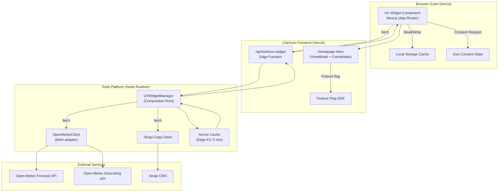

# Architecture — UV Index Widget

**Legend**

- Frontend coordinates consent, local caching, and renders hero UI.
- Tools platform manager centralizes API calls, caching, and copy retrieval.
- Open-Meteo provides UV/forecast data; Strapi stores localized risk copy.
