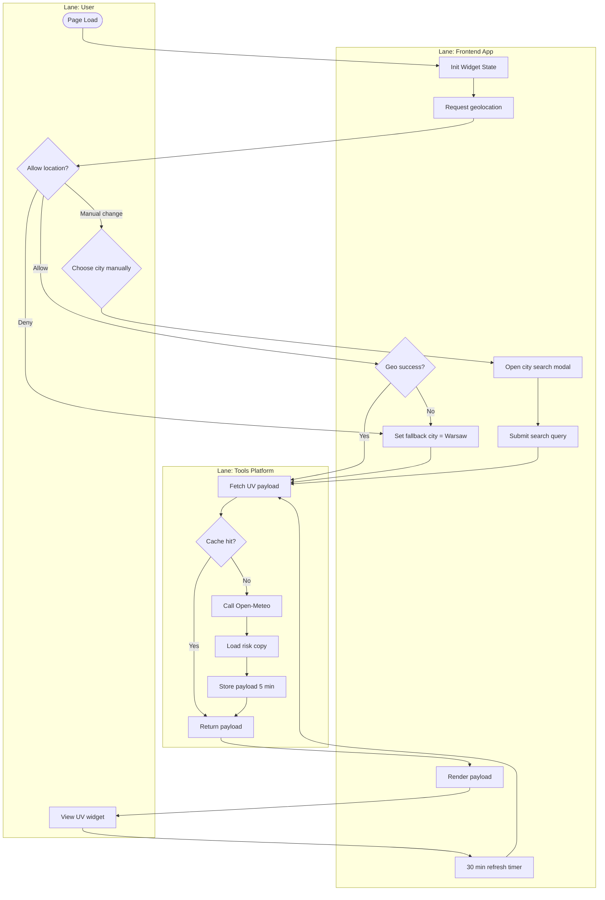

# Process — UV Widget Consent & Refresh Flow

**Process highlights**

- User choice drives either direct geolocation or fallback to Warsaw.
- Manual city selection branches into the geocoding workflow before fetching UV data.
- Refresh timer reuses the same payload fetch, respecting cache TTLs.
