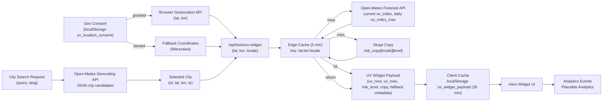

# Data Lineage — UV Index Widget

**Key notes**

- Local storage caches the response for 30 min; expiry triggers a background refresh.
- Edge cache shields Open-Meteo from spikes and enforces 5 min freshness policy.
- Analytics capture consent state and UV values without persisting precise coordinates.
