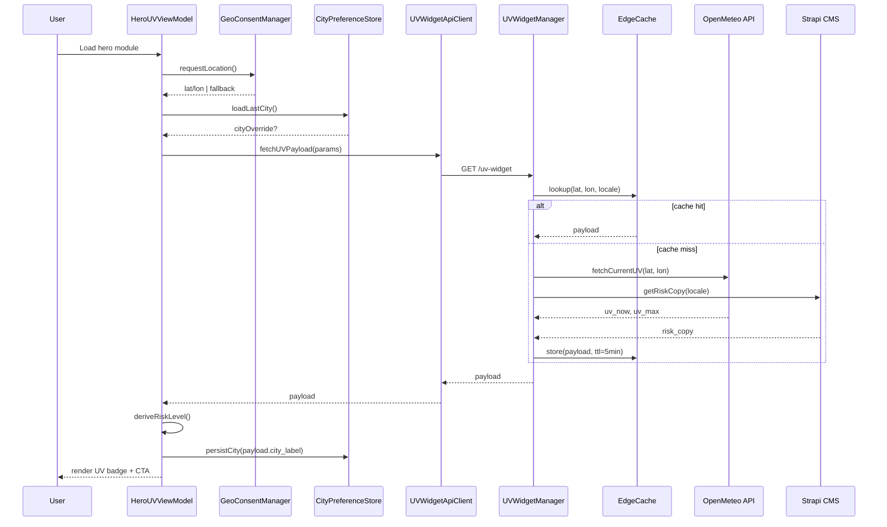

# Domain Sequence — UV Index Widget Load

**Domain roles**

- `HeroUVViewModel` composes state for the React component.
- `UVWidgetManager` encapsulates API aggregation, caching, and output shaping.
- `GeoConsentManager` tracks consent lifecycle; `CityPreferenceStore` handles overrides.
